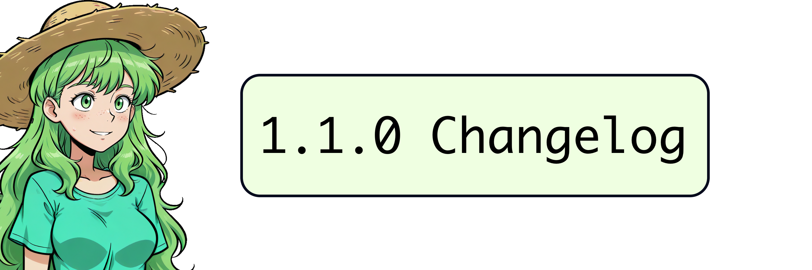

Hey everyone! It's **V**, the VNCCS mascot! 🎉 Today, instead of the lazy developer, I'll tell you about the update!

My dev and I listened to your complaints for a long time and decided to try fixing everything at once. The problem was that most issues came from external nodes. Well, problems need *radical solutions*! 💪

## 🚀 Major Changes
- **Reduced Dependencies**: We got rid of most external dependencies, keeping only the most important ones! Now the project has built-in most of the utility nodes that do simple but very important things!
- **Forked RMBG Nodes**: We also forked the core RMBG nodes (because the authors decided to change their logic and broke everything for us!!! 😠) so guys from [AILab](https://github.com/1038lab/ComfyUI-RMBG/blob/main/AILab_BiRefNet.py "AILab_BiRefNet.py"), please don't be mad at us. 🙏
- **Improved Sprite Generator**: The sprite generator work has been reworked. Now the order of the resulting sprites is always the same! (Finally! This annoyed me too! 🎯)
- **Cleanup**: Removed the junk we ended up not using, so the project became lighter. 🧹
- **Workflow Updates**: We also reworked all the workflows, so now they are more reliable and a bit simpler! (Phew, hope we didn't break anything in the process! 🤞)
- **New Character Sheet Template**: Added a new example character sheet for young (or just short) characters! Thanks to user gmork! He helped us a lot! You can find it in the project folder (`character_template/CharacterSheetTemplateShort.jpg`). 🌟

## 🔮 What's Next?
Right now my master is working hard on taming **qwen image edit 2509**, which promises to take clothing generation to a completely new, previously unattainable level! 🚀  
But it's very hard, especially when working on an RTX 4060. 😓

If you like our project, you can always help by making a small contribution to buying new equipment, it will help us a lot! ❤️

Stay tuned for more updates! 💖