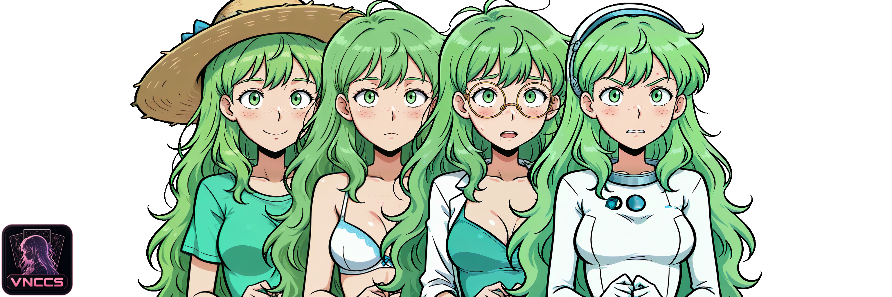
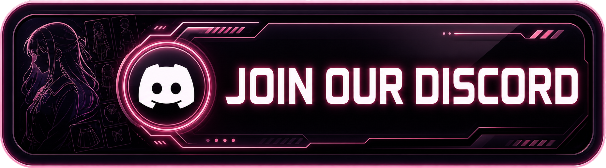
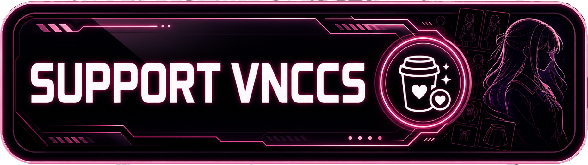

---
# VNCCS - Visual Novel Character Creation Suite

VNCCS is NOT just another workflow for creating consistent characters, it is a complete pipeline for creating sprites for any purpose. It allows you to create unique characters with a consistent appearance across all images, organise them, manage emotions, clothing, poses, and conduct a full cycle of work with characters.

## Description

Many people want to use neural networks to create graphics, but making a unique character that looks the same in every image is much harder than generating a single picture. With VNCCS, it's as simple as pressing a button (just 4 times).

## Character Creation Stages

The character creation process is divided into 5 stages:

1. **Create a base character**
2. **Clone any existing character**
3. **Create clothing sets**
4. **Create emotion sets**
5. **Generate finished sprites**
6. **Create a dataset for LoRA training** (optional)

---

<table>
<tr>
<td width="50%" align="center">
<strong>Join The Community</strong> 
Share results, ask questions, and follow VNCCS updates.  

</td>
<td width="50%" align="center">
<strong>Support VNCCS</strong> 
VNCCS is developed independently. Support helps keep the project moving.  

</td>
</tr>
</table>

---

## Installation

Find `VNCCS - Visual Novel Character Creation Suite` in Custom Nodes Manager or install it manually:

1. Place the downloaded folder into `ComfyUI/custom_nodes/`
2. Launch ComfyUI and open Comfy Manager
3. Click "Install missing custom nodes"
4. Alternatively, in the console: go to `ComfyUI/custom_nodes/` and run `git clone https://github.com/AHEKOT/ComfyUI_VNCCS.git`

## Required Models

**V-chan:** VNCCS 3.0 uses the new **VNCCS Control Center**. Open any 3.0 workflow, click **Download ALL**, and the node will put the main models into the correct ComfyUI folders. No restart needed for LoRAs. Very civilized.

**Q-Chan:** The default path is **Qwen Image Edit 2511**. Q5 GGUF is the comfy middle ground, Q4 is lighter, and Q8 is hungrier.

Control Center currently shows:
- **MODEL (3)** - GGUF Q4, Q5, Q8
- **CLIP + VAE (2)** - QIE2511 text encoder and VAE
- **TURBO MODEL (1)** - Qwen Image Edit 2511 Lightning
- **LORA (3)** - Clothes Core, Emotion Core, Pose Studio
- **CONTROLNET (0)** - no entries
- **OTHER (1)** - 4x APISR upscaler

Control Center downloads come from:
- `MIUProject/VNCCS_v3.0`
- `unsloth/Qwen-Image-Edit-2511-GGUF`
- `f5aiteam/CLIP`
- `Comfy-Org/Qwen-Image_ComfyUI`
- `MIUProject/VNCCS_PoseStudio`

### Main Generation Models

**V-chan:** Pick one GGUF model in Control Center. If you are not sure, use the workflow default: **Q5**.

- `Qwen-Image-Edit-2511-GGUF-Q4` -> `models/unet/qwen-image-edit-2511-Q4_0.gguf`
- `Qwen-Image-Edit-2511-GGUF-Q5` -> `models/unet/qwen-image-edit-2511-Q5_0.gguf`
- `Qwen-Image-Edit-2511-GGUF-Q8` -> `models/unet/qwen-image-edit-2511-Q8_0.gguf`

There is also a **Custom** tab if you want to pass your own model into the Control Center manually.

### Text Encoders and VAE

- `QIE2511_Text_Encoder` -> `models/text_encoders/qwen_2.5_vl_7b_fp8_scaled.safetensors`
- `QIE2511 VAE` -> `models/vae/qwen_image_vae.safetensors`

### VNCCS LoRAs

**V-chan:** These are the little helpers that keep the whole character factory from falling apart dramatically.

- `VNCCS Clothes Core` -> `models/loras/qwen/VNCCS/VNCCS_QIE2511_ClothesCore-RC3.safetensors`
- `VNCCS Emotion Core` -> `models/loras/qwen/VNCCS/VNCCS_QIE2511_EmotionCore-RC1.safetensors`
- `VNCCS Pose Studio QIE2511` -> `models/loras/qwen/VNCCS/VNCCS_QIE2511_PoseStudio_ART_V5.9.5.safetensors`
- `Qwen Image Edit 2511 Lightning` -> `models/loras/qwen/Qwen-Image-Edit-2511-Lightning-4steps-V1.0-bf16.safetensors`

### Utility Models

- `4x_APISR_GRL_GAN_generator.pth` -> `models/upscale_models/4x_APISR_GRL_GAN_generator.pth`

**Q-Chan:** ControlNet section is empty in the current Control Center. If you see old guides asking for ControlNet models, they are from the old workflow.

**Q-Chan:** RMBG-2.0 background removal is handled by VNCCS when needed. The architecture files are downloaded from pinned HuggingFace revisions, and VNCCS does not use `trust_remote_code` fallback for those loaders.

### Qwen2.5-VL Helper Model

Character Cloner and the clothing wizard can auto-describe images with Qwen2.5-VL. This is not a Control Center card; it has its own download button in the UI.

- `Qwen2.5-VL-7B-Instruct-Q4_K_M.gguf`
- `mmproj-F16.gguf`

**V-chan:** If these are missing, the UI has a download button. Press it, wait a bit, pretend you are patient.

# Usage

VNCCS 3.0 is no longer a long chain of old workflows. The new workflow is:

1. **Create a character** or **clone a character**
2. **Generate clothes**
3. **Generate emotions**
4. Use the saved sprites in your visual novel

Everything is saved in:

`ComfyUI/output/VNCCS/Characters/YOUR_CHARACTER_NAME`

---

## Step 0: Migration Assistant

Open `VNCCS_MigrationAssistent.json` if you have characters from old VNCCS versions.

This node scans legacy folders and moves characters into the new 3.0 structure.

If you are starting fresh, skip this step. No need to migrate air.

---

## Step 1: Create a Base Character
Open `VNCCS_3.0_Step1_CharacterCreator.json`.

### VNCCS Control Center

**Q-Chan:** First, check Control Center. Select your Qwen model, click **Download ALL** if models are missing, and make sure the Lightning LoRA enabled.
Default workflow settings:
- Model type: `gguf`
- Model: `Qwen-Image-Edit-2511-GGUF-Q5`
- Steps: `4`
- CFG: `1`
- Sampler: `euler`
- Scheduler: `karras`

### VNCCS Pose Studio

### Character Creator V2

**V-chan:** Write the character name, fill appearance fields, and click **Create New Character**.

**Q-Chan:** Then click **Generate Preview** before running the workflow. Preview is cheaper than regret.

The creator outputs:
- `character`
- `sheets_path`
- `background`

Those outputs go into `VNCCS Character Generator`, which creates:
- character sheet
- faces
- pose generation preview
- upscaled result
- background-removed sprite sheet

Useful settings:
- **Target Size** - `1024` is the safe default.
- **Background** - Green is default, Blue is better if character has green parts.
- **Upscaler** - more resolution means more details and more VRAM.
- **BG Remove** - tolerance removes leftovers, but too much can bite into the character.

---

## Step 1.1: Clone Any Character

Open `VNCCS_3.0_Step1_CharacterCloner.json`.

**V-chan:** Use this when you already have a character image and want VNCCS to build a usable character from it.

**Q-Chan:** Full body images work best. It can work with portraits too, but then the model will invent missing parts. Sometimes it is smart. Sometimes it is very confident and very wrong.

How to use:
- Add one or more source images.
- Let Qwen2.5-VL auto-fill character tags, or edit them yourself.
- Pick poses in Pose Studio.
- Run the workflow.

The clone workflow creates:
- original-clothes sprites
- cleaned/naked base sprites
- faces
- upscaled previews

---

## Step 2: Create Clothing Sets

Open `VNCCS_3.0_Step2_CharacterClothes.json`.

### Clothes Designer

**V-chan:** Select your character, create a costume name, then describe the outfit.

**Q-Chan:** There are two useful modes:

- **Generate Clothes** - write top, bottom, head, face, and shoes manually.
- **Clone Clothes** - upload a reference image and transfer the outfit to your character.

The workflow uses:
- `VNCCS Clothes Core`
- `Qwen Image Edit 2511 Lightning`
- `VNCCS Pose Studio QIE2511`

Tips:
- Keep the background Green or Blue.
- If clothes eat body parts, try another seed.
- Complex multi-layer clothing can be unpredictable.
- For difficult outfits, describe materials and shape clearly.
- Create as many costumes as you need. VNCCS stores them in the character config.

**V-chan:** Clothes helper LoRA is much better than before, but it is still not a mind reader. Be kind to it. Use words.

---

## Step 3: Emotion Studio

Open `VNCCS_3.0_Step3_CharacterEmotions.json`.

### Emotion Generator V2

**V-chan:** Select a character, select one or more costumes, then click the emotions you want.

**Q-Chan:** Emotion Studio uses the selected character and costumes, then passes the chosen emotion pairs into `VNCCS Emotions Generator`.

Emotion Studio supports:
- visual emotion selection
- multi-costume generation
- batch emotion pairs
- face denoise control

The node outputs images, pipe, and emotion data into `VNCCS Emotions Generator`, which saves the final emotion sprites and faces.

**V-chan:** Denoise controls emotion strength. Too low and the face barely changes. Too high and your character becomes a different person with suspicious confidence.

---

## Output Structure

VNCCS saves your work here:

`ComfyUI/output/VNCCS/Characters/YOUR_CHARACTER_NAME`

Inside you will find:
- character config JSON
- generated sheets
- faces
- costumes
- emotion sprites
- cache files used by previews and regeneration

**Q-Chan:** Do not delete the config unless you really mean it. The config is the character's memory, and memory is cheaper than regenerating everything.

---

## Regeneration and Preview

The 3.0 generator nodes keep enough data to regenerate selected stages from the UI.

- Character Creator V2 can preview before running the workflow.
- Clothes Designer can preview outfits.
- Emotion Studio can generate selected emotion/costume pairs.
- Generator nodes can reuse cached inputs for stage regeneration.

**V-chan:** This means you can fix one bad result without rebuilding the whole castle. Very good. Very merciful.

---

## Old Workflows

Old workflows are deprecated. The new 3.0 workflow replaces separate sprite-generation steps with integrated generator nodes:

- `VNCCS Character Generator`
- `VNCCS Character Clone Generator`
- `VNCCS Clothes Generator`
- `VNCCS Emotions Generator`

**Q-Chan:** If you see an old guide mentioning `VN_Step4_SpritesGenerator`, `VN_Step5_DatasetCreator`, or separate ControlNet setup, that is old magic. 3.0 does not need it for the main character pipeline.

---

## Conclusion

**V-chan:** Congratulations! You created a character, dressed them up, gave them emotions, and now they are ready to stand in your visual novel and judge the player silently.

**Q-Chan:** Back up your `ComfyUI/output/VNCCS/Characters` folder regularly. Characters are precious. Storage is cheap. Tears are not.

Good luck creating your visual novels!

---

Future plans:
- consistent background generation
- animated sprites
- animation of transitions between poses
- automatic translation of RenPy games into other languages
- automatic voice generation for RenPy games
---
