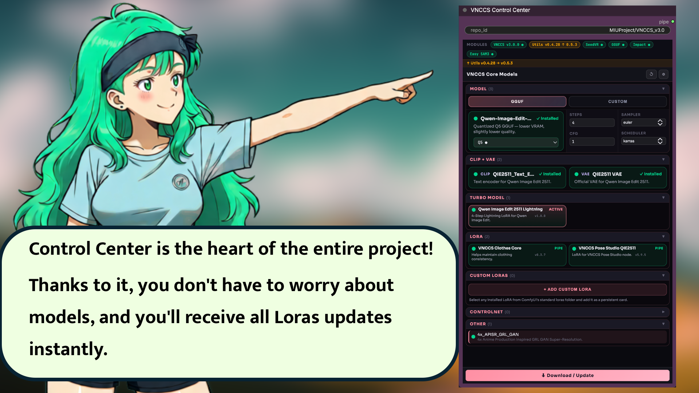
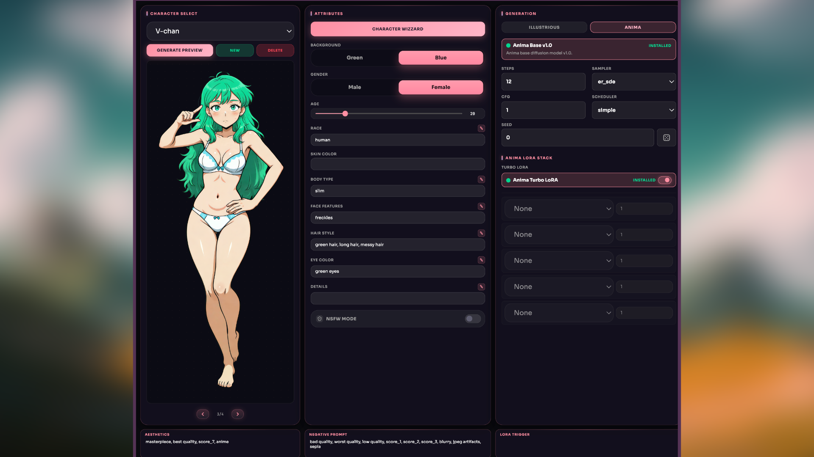
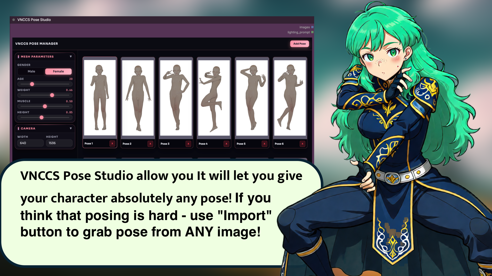
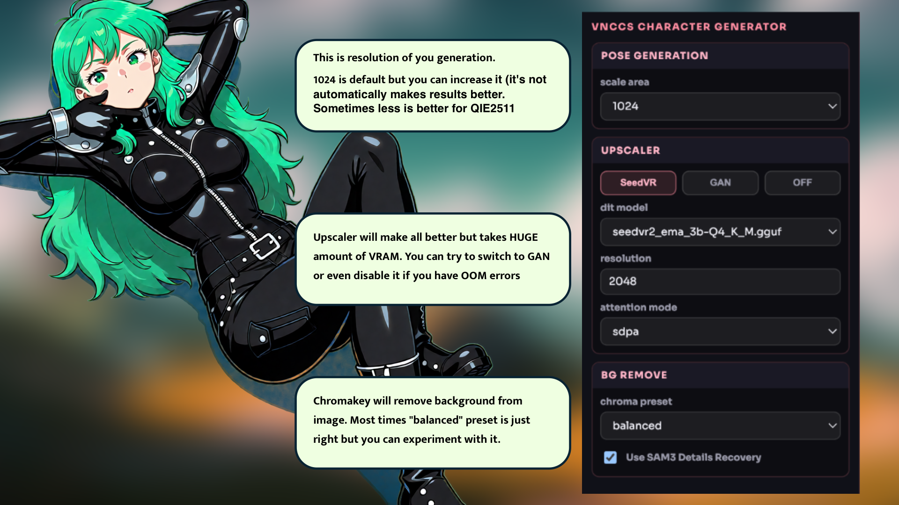
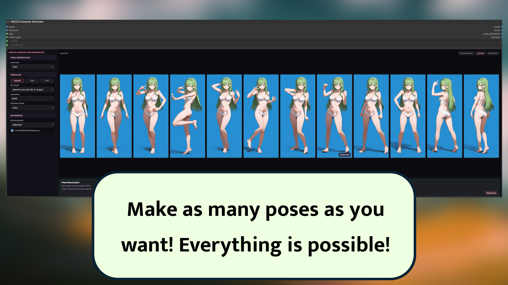

---
# VNCCS - Visual Novel Character Creation Suite

<table>
<tr>
<td width="50%" align="center">
<strong>Join The Community</strong> 
Share results, ask questions, and follow VNCCS updates.  

</td>
<td width="50%" align="center">
<strong>Support VNCCS</strong> 
VNCCS is developed independently. Support helps keep the project moving.  

</td>
</tr>
</table>

---

VNCCS is NOT just another workflow for creating consistent characters, it is a complete pipeline for creating sprites for any purpose. It allows you to create unique characters with a consistent appearance across all images, organise them, manage emotions, clothing, poses, and conduct a full cycle of work with characters.

## Description

Many people want to use neural networks to create graphics, but making a unique character that looks the same in every image is much harder than generating a single picture. With VNCCS, it's as simple as pressing a button (just 4 times).

## Installation

Find `VNCCS - Visual Novel Character Creation Suite` in Custom Nodes Manager or install it manually:

1. Place the downloaded folder into `ComfyUI/custom_nodes/`
2. Launch ComfyUI and open Comfy Manager
3. Click "Install missing custom nodes"
4. Alternatively, in the console: go to `ComfyUI/custom_nodes/` and run `git clone https://github.com/AHEKOT/ComfyUI_VNCCS.git`

## VNCCS 3.0 Workflow

Hi! My name is V-chan, and I am going to show you how to use the new VNCCS!

We got a BIIIIIIG update, and now everything is completely new, so listen carefully!

## Step 1: Character Creator

Open the workflow:

`VNCCS_3.0_Step1_CharacterCreator.json`

Let's start from the very beginning. The first thing you need to do, besides opening the workflow, silly, is figure out the **VNCCS Control Center**.

Inside it, you will find all the models used in the workflow. Choose the one that fits your computer and press **Download**.

- **Q4** is light, but in some places the result may be a little less fancy.
- **Q5** is a great balance between quality and performance.
- **Q8** is the heaviest one, but it will make you the best characters.

Choose wisely, but in the end nobody is stopping you from trying them all and deciding later.

And then, at the very bottom of the widget, you can click the big **Download** button and the magic will do everything by itself.

Next, go to **VNCCS Character Creator V2**.

The most important thing here is to create a new character and choose the model for generation.

**Illustrious** may be considered old, but it makes excellent characters and has a huge selection of LoRAs for every style and occasion. Do not worry about quality, it will not disappoint you!

**Anima** is a new and cool model. It can do almost everything, but it will need a bit more resources, and there are not as many LoRAs for it yet.

I recommend trying both and deciding for yourself.

Right now you do not have any characters yet, so press **NEW** and give him or her a name! The name is very important!!! Be creative and unique!

Done? Good job! Now you have two paths:

1. Manually enter tags. The pencil icons above the fields are tag builders, and they will help you. Choose sex, age, and generation type. The **NSFW** switch controls whether the base character will have clothes or not :3
2. Press **CHARACTER WIZZARD**, describe the character you want, and after a little magic the system will set all the needed options by itself. Do not forget to check them!

A new little feature is the **GENERATE PREVIEW** button. It lets you see what the character will look like without restarting the whole generation. So press it already, and if you like everything, move on. If you want to make changes, edit the tags and press it again!

## VNCCS Pose Studio

The next key node is **VNCCS Pose Studio**.

It is downloaded from my second project, **VNCCS-Utils**, so do not forget to install that too!

Here, the most important thing is to choose the poses you need and how many of them there should be. You can control the model however you want and make absolutely any poses. Also, using the **Import** button, you can load any picture with a character and get a pose just like the one in the picture!

It is also very important that the body proportions of the model fit your character. Age will be set automatically from the previous step, but nobody will stop you from setting it manually. Also choose height and body type, the result will be much better that way.

In **VNCCS Character Generator**, you do not really need to worry about the settings, but if you want, you can choose the upscaler model or even turn it off.

In **BG Remove**, you can choose a chroma key preset. **Balanced** is a very good preset, but if it is not enough for you, or if it is too much and starts damaging the character, choose a lighter one.

**SAM3 Details Recovery** makes background removal slower, but it lets you worry less about eye color and clothing elements that are the same color as the background. We will talk about clothes a little later.

Ready? Then press **Run**! Now just wait, and the magic will do everything for you!

## Step 1.1: Character Cloner

Open the workflow:

`VNCCS_3.0_Step1_CharacterCloner.json`

This workflow is basically a complete copy of Character Creator, but it is made for cloning existing character images.

Did you generate the character with another model? Download it from the internet? Take a screenshot from your favorite anime? Draw it yourself, with your own hands? Good job!

Try to make sure the picture is good quality and that the character is full body, otherwise the model will invent everything that is not visible in the picture!

Now load it into **VNCCS Character Cloner**, write tags or press **ANALYZE CAPTIONS**, set up everything you need in **VNCCS Pose Studio**, and do not forget to choose whether you need separate undressed sprites with the **NSFW** button. They are not mandatory, but dressing these characters later will be MUCH easier!

Also try to choose a background color that appears the least in the character. Look at the eyes and hair. If they are green, choose blue. Or the other way around.

Now press **Run** and look at the result!

## Step 2: Character Clothes

Open the workflow:

`VNCCS_3.0_Step2_CharacterClothes.json`

Now we move to the tastiest part! In this workflow, you will make clothes for the character. As many sets as you think you need.

Choose a character in **VNCCS Clothes Designer** and press **New**. Give the outfit set a name and get ready to create!

You have two options again:

1. Describe all clothing elements in the needed fields. You do not have to follow them exactly, but the **head** and **face** sections will help you later not to lose details during emotion generation, so do not slack off! If the character has glasses, write them in **face**. A hat goes in **head**. Easy!
2. Press **Clothes Wizzard** and simply describe the clothes you want!

You also have an option to clone any clothes from any picture! Open the **CLONE CLOTHES** tab and upload an image of clothes, or a character wearing clothes.

The **GENERATE PREVIEW** button will help you see what your character will look like before starting the big and heavy generation of all poses.

And that is all! Again, do not forget about **VNCCS Pose Studio**, and press **Run**!

When you finish the first set, you can press **New** again and create as many outfits as you want!

## Step 3: Character Emotions

Open the workflow:

`VNCCS_3.0_Step3_CharacterEmotions.json`

Here we will create emotions for the character! Up to this moment, all sprites had a calm facial expression. This will be our base.

In the **VNCCS Emotion Studio** widget, choose the character you are going to make emotions for. In **Selected costumes**, choose all costumes you want to work with.

Now, in the huge list, click the emotions you need and add them to the selected ones. Also, if by some miracle you did not find what you need, you can add a **Custom** emotion and describe what you want yourself.

After that, you again need to decide which model will do the generation.

**Illustrious** is stable, but the variety of emotions depends very strongly on the exact character, style, and model. Not all emotions may come out equally well.

**Anima** makes very cool emotions, but it is still too young, so it can be unstable. It can change character details too much, so try it yourself and decide what you like better.

In **VNCCS Emotions Generator**, the most important setting is **Face Detailer Denoise**. It will suggest optimal values by itself, but remember one basic idea: the higher the denoise, the more the original image changes.

More denoise means a brighter emotion, but the character may stop looking like themselves.

Less denoise means a more accurate character, but the emotion may be weaker.

There is no ready-made recipe here. It all depends on the character and the selected model, so be creative and a tiny bit more patient.

For the first try, do not select all costumes and emotions at once. It will take a long time, and if the result does not satisfy you, it will be sad. Better find the optimal settings first, and then go all in!

Press **Run**, and may luck be with you!

At this point, the current VNCCS features end, but not for long! Planned features include animations, 3D environments and CG image creation inside them, character voice generation, and music track generation for your game or project.

You will find all your sprites inside ComfyUI in:

`output/vnccs`

Be careful with them, and do not delete them by accident while cleaning your disk!
