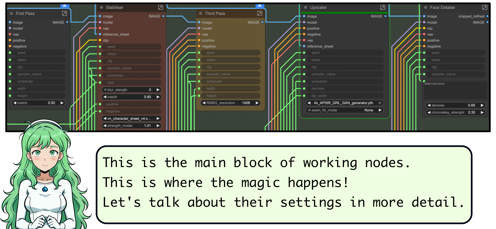

---
# VNCCS - Visual Novel Character Creation Suite

VNCCS is NOT just another workflow for creating consistent characters, it is a complete pipeline for creating sprites for any purpose. It allows you to create unique characters with a consistent appearance across all images, organise them, manage emotions, clothing, poses, and conduct a full cycle of work with characters.

## Description

Many people want to use neural networks to create graphics, but making a unique character that looks the same in every image is much harder than generating a single picture. With VNCCS, it's as simple as pressing a button (just 4 times).

## Character Creation Stages

The character creation process is divided into 5 stages:

1. **Create a base character**
2. **Clone any existing character**
3. **Create clothing sets**
4. **Create emotion sets**
5. **Generate finished sprites**
6. **Create a dataset for LoRA training** (optional)
---
## **If you find my project useful, please consider supporting it! I work on it completely on my own, and your support will allow me to continue maintaining it and adding even more cool features!**

## Installation

Find `VNCCS - Visual Novel Character Creation Suite` in Custom Nodes Manager or install it manually:

1. Place the downloaded folder into `ComfyUI/custom_nodes/`
2. Launch ComfyUI and open Comfy Manager
3. Click "Install missing custom nodes"
4. Alternatively, in the console: go to `ComfyUI/custom_nodes/` and run `git clone https://github.com/AHEKOT/ComfyUI_VNCCS.git`

## Required Models

VNCCS requires the following models in ComfyUI. Make sure they are installed in the correct directories:

### Stable Diffusion Checkpoints (`models/checkpoints/`)
- Any illustrious based model.
- Should work on any SDXL model, but not tested.

### LoRA Models (`models/loras/`)
- `vn_character_sheet_v4.safetensors`
- `DMD2/dmd2_sdxl_4step_lora_fp16.safetensors`
- `vn_character_sheet.safetensors`
- `IL/mimimeter.safetensors`
- `QWEN/all_loras_from_here`

### ControlNet Models (`models/controlnet/`)
- `SDXL/AnytestV4.safetensors`
- `SDXL/IllustriousXL_openpose.safetensors`

### Face Detection Models (`models/ultralytics/bbox/` and `models/ultralytics/segm/`)
- `bbox/face_yolov8m.pt`
- `bbox/face_yolov9c.pt`
- `segm/face_yolov8m-seg_60.pt`

### SAM Models (`models/sams/`)
- `sam_vit_b_01ec64.pth`

### Upscale Models (`models/upscale_models/`)
- `4x_APISR_GRL_GAN_generator.pth`
- `2x_APISR_RRDB_GAN_generator.pth`

All models must be placed in the standard ComfyUI directories according to their type.

You can download them from my huggingface: https://huggingface.co/MIUProject/VNCCS/tree/main

# Usage 

### Step 1: Create a Base Character

Open the workflow `VN_Step1_QWEN_CharSheetGenerator`.

#### VNCCS Character Creator
- First, write your character's name and click the ‘Create New Character’ button. Without this, the magic won't happen.
- After that, describe your character's appearance in the appropriate fields.
- SDXL is still used to generate characters. A huge number of different Loras have been released for it, and the image quality is still much higher than that of all other models.
- Don't worry, if you don't want to use SDXL, you can use the following workflow. We'll get to that in a moment.

### New Poser Node

#### VNCCS Pose Generator
To begin with, you can use the default poses, but don't be afraid to experiment!
- At the moment, the default poses are not fully optimised and may cause problems. We will fix this in future updates, and you can help us by sharing your cool presets on our Discord server!

### Step 1.1 Clone any character

- Try to use full body images. It can work with any images, but would "imagine" missing parst, so it can impact results.
- Suit for anime and real photos

### Step 2 ClothesGenerator
Open the workflow `VN_Step2_QWEN_ClothesGenerator`.

- Clothes helper lora are still in beta, so it can miss some "body parts" sizes. If this happens - just try again with different seeds.

### Step 3: Emotion Studio

Open the workflow `VN_Step3_CharEmotionGenerator` for SDXL processing or `VN_Step3_QWEN_EmotionStudio` for new experemental QWEN emotion generator.

#### VNCCS Emotion Studio
The new Emotion Studio provides a convenient visual interface for managing character expressions.

- **Visual Selection**: Browse and select emotions from a visual grid instead of text lists.
- **Multi-Costume Support**: Select one or multiple costumes to generate emotions for all of them in one batch.
- **Prompt Styles**: Choose between **SDXL Style** (classic) or **QWEN Style** (improved) for different generation pipelines.

Select your character, pick the clothes, click on the desired emotions, and run the workflow. The system will generate faces and sheets for every selected combination!

### Steps 4 and 5 are not changed, you can follow old guide below.

### Be creative! Now everything is possible!

# Usage (Old SDXL WorkFlows)

Always use the latest versions of workflows!

### Step 1: Create a Base Character

Open the workflow `VN_Step1_CharSheetGenerator`.

#### Character Sheet

Default character sheet lay is in `character_template` folder

---
#### Settings

---
#### VNCCS Character Creator

---
#### Service Nodes

---
#### Workflow Nodes

---
#### **First Pass**
Initial generation. Raw and imprecise, used for visual identification of the character.
- **Match** - how much the new character would look like character from initial charsheet. Too low and too high settings are not recommended and will result to unwanted things.
Safe to stay in about 0.5, but you can test other values!
---
#### **Stabilizer**
Stabilizes the initial generation, bringing it to a common look.
- **Blur** - blur level for complex cases to help small differences disappear.
- **Match** - similarity level (0.85 is safe, range 0.4-1.0)
- LoRA trained on character sheet to help with matching things.
---
#### **Third Pass**
Third generation pass using the stabilized character sheet.
- **RMBG Resolution** - it's very important for great sprites. 1408 - maximum resolution for 8GB VRAM cards! But you can set 1536 if you have better videocard than me.
But if you have troubles - you can lower it to 1024 and edit small mistakes manualy.
Better resolution - better mask!
---
#### **Upscaler**
Improves character sheet quality by adding details.
- **Denoise** - strength in settings (safe values 0.4-0.5). More denoise - more details. More details - more inconsistency with small details on character. Stay in balance!
- **Seam Fix Mode** - to the best results, set to "Half Tile + intersections but this will result in dramatically increased generation time.
---
#### **Face Detailer**
Improves face quality.
- **Value range:** 0.2-0.7 (default 0.65). Higher value - more changes.
---

---
### Step 2: Create Clothing Sets

Open the workflow `VN_Step2_ClothesChanger`.

It's similar to the first, but has key differences:

#### **VNCCS Character Selector**

---
**Workflow nodes work the same way as in Character Creator.
So, let focus of the nuances of settings:**

- Lower match strength means better and more diverse clothing, but the character may look less like themselves
- Higher strength means the node repeats the previous result more
- Find a balance between diversity and consistency
- For complex clothing, look for similar examples on Danbooru for accurate tags
- Complex multi-layered costumes may give unpredictable results
- If the character is generated without clothes, fix the prompt – the model doesn't understand what to draw.
---

Create as many costumes as you need. All data is saved in `ComfyUI/output/VN_CharacterCreatorSuit/YOUR_CHARACTER_NAME`, parameters are in the JSON config.

After creating costumes, proceed to emotions.

Open the workflow `VN_Step3_EmotionsGenerator`.

---
### Step 3: Create Emotion Sets - Deprecated and replaced with EmotionStudio (still available in old_workflows folder)

This step is similar to the previous ones, but focuses on creating emotions for your character.

#### VNCCS Emotion Generator

- **Denoise** greatly impacts emotion strength but too high values can distort face of character and affect consistency.

After setting the parameters, click "Run".

Emotions will be generated and saved in the `ComfyUI/output/VN_CharacterCreatorSuit/YOUR_CHARACTER_NAME/Sheets/spaceman/EMOTION_NAME` folder for your character.

---
### Step 4: Generate Finished Sprites

After creating the character and their emotions, you can generate finished sprites for use in your visual novel.

Open the workflow `VN_Step4_SpritesGenerator`.

---
#### Sprite Generator

- **Select character** - choose the character for which you want to generate sprites.
Click "Run" and wait for the process to finish.

The finished sprites will appear in the folder `ComfyUI/output/VN_CharacterCreatorSuit/YOUR_CHARACTER/Sprites`

---
### Step 5: Create a Dataset for LoRA Training (Optional)

This step is optional and intended for those who want to further train their LoRA model on the created characters.

Open the workflow `VN_Step5_DatasetCreator`.

#### Dataset Creator

- **Select characters** – choose the characters you want to include in the dataset.
- **Game Name** – a prefix that will be added to the character's name in the dataset, e.g. VN_your_character_name.
Click "Run" and wait for the process to finish.
The dataset will appear in the folder `ComfyUI/output/VN_CharacterCreatorSuit/YOUR_CHARACTER/Lora`

## Conclusion

Congratulations! You have successfully created your own character using VNCCS. Now you can use it in your projects or continue experimenting with the settings to create new unique characters.

Don't forget to save all your work and regularly back up your data. Good luck creating your visual novels!

---

Future plans: 
- implement more "modern" models like qwen, flux and nanobanana
- consistent background generation
- animated sprites
- animation of transitions between poses
- automatic translation of the game on RenPy into other languages.
- automatic voice generation for the game on RenPy
---

